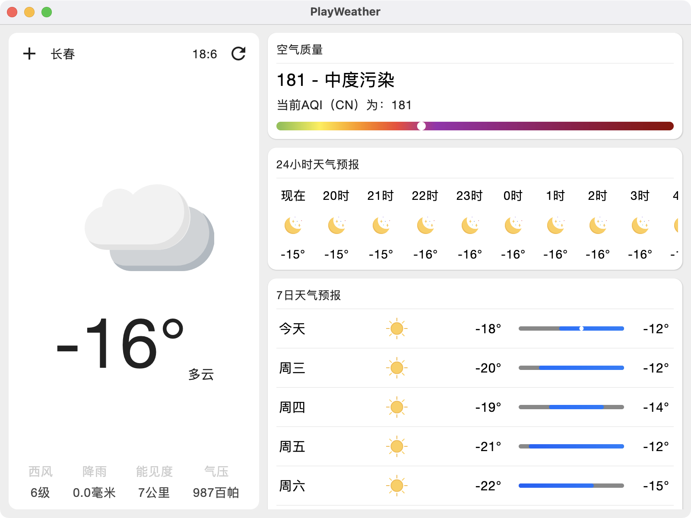
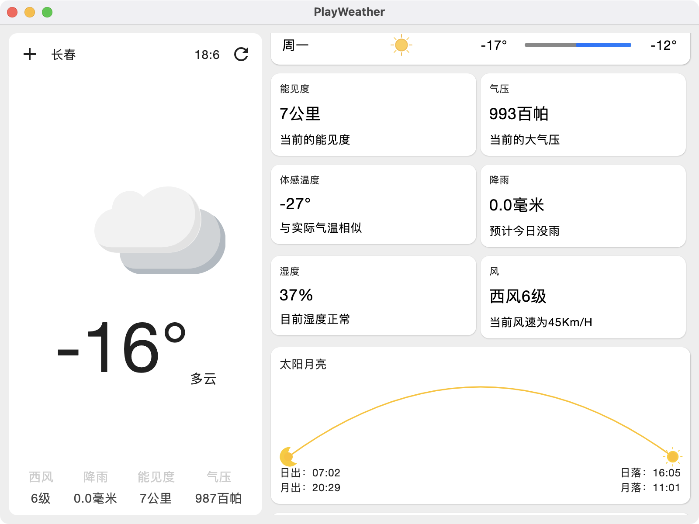
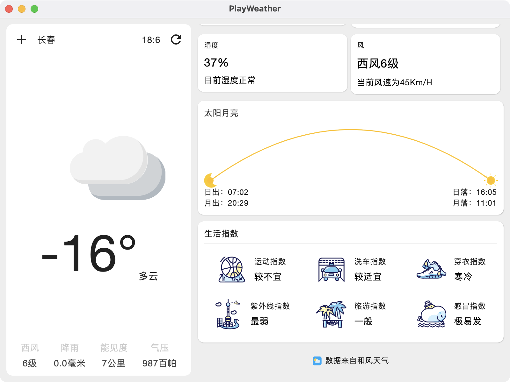
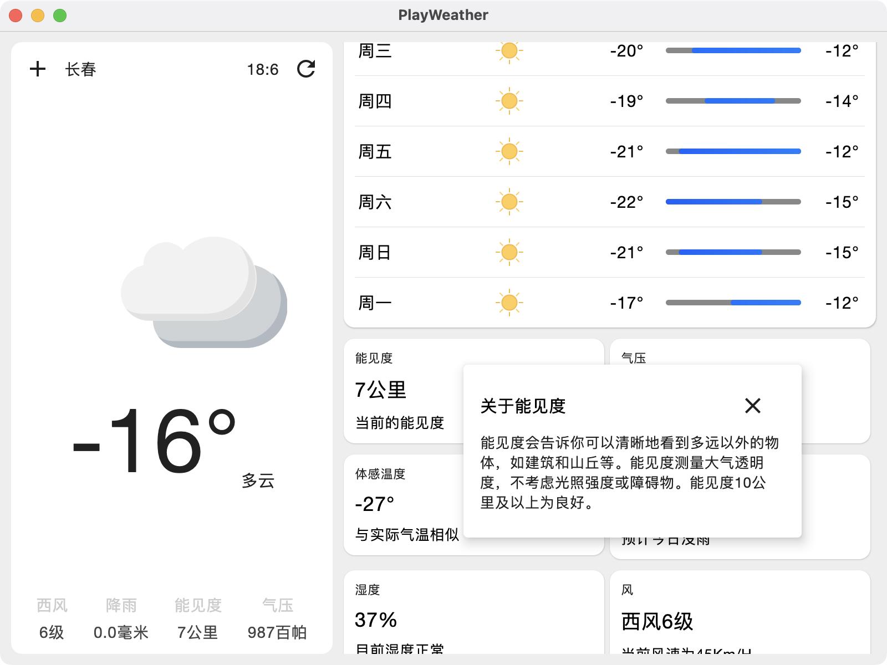
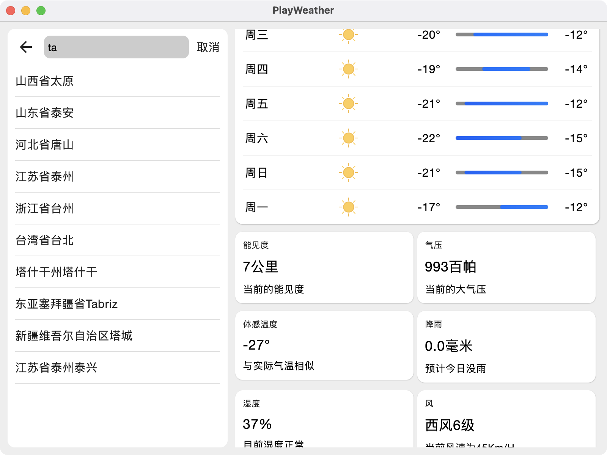
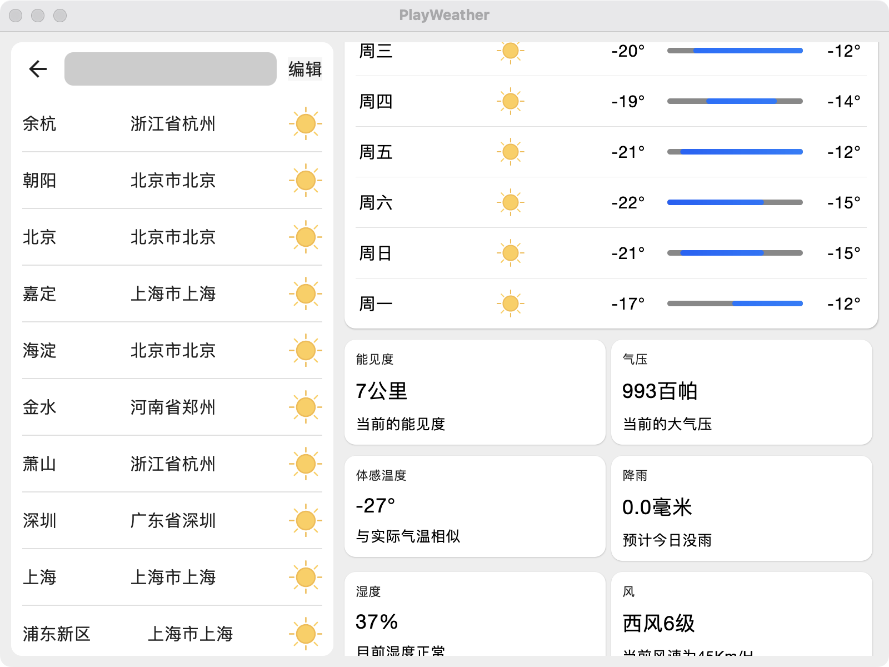

# Compose Desktop
## 可以生成适用于 macOS、Linux 和 Windows 的应用程序。您可以通过我们的模板使用这些平台中的任何一个。 
本示例用于桌面天气预报 
先来看看项目运行效果吧！

## 项目截图
                             | 
|---------------------------------------------------------------|---------------------------------------|
                             |   
                             |   

## 说明

本项目可以让大家用作学习，不可以任何的形式进行商用，因为我也是从别人那里学习的。

